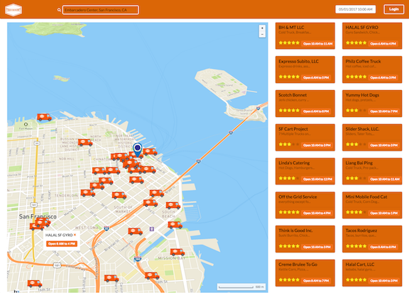

# TruckHunt SF

Browse nearby food trucks in San Francisco; order food ahead of time so that it's ready for pickup when you arrive. Vendors can sign up through our vendor portal to accept payment and manage new and past orders. 

[Video Demo](https://www.youtube.com/watch?v=iVUxqjB9uu4)



## Team

  - Matt Schmitz
  - Benicio Peinado
  - Sam Zoll
  - Michael Burton

## Table of Contents

1. [Data](#data)
1. [Tech Stack](#tech-stack)
1. [Payments](#payments)
1. [Database](#database)
1. [Testing](#testing)
1. [Requirements](#requirements)
    1. [Installing Dependencies](#installing-dependencies)
1. [Contributing](#contributing)
1. [License](#license)

## Data

Truck schedules and permit information comes from [SF Open Data], which publishes a variety of data for mobile food vendors in SF.

If you are interested in testing and developement you can find sample data in JSON format within [database/data](database/data).  Once you have installed PostgreSQL you must seed the [database](#database). 

## Tech Stack
  - [React] with [React-Router] & [Redux]
  - [Node] & [Express]
  - [PostgreSQL] with [pg-promise]
  - [Semantic-UI-React]
  - [Jest] with [Supertest] & [Enzyme]

## Payments

This application utilizes the Stripe API to allow payments for both vendors and customers. Stripe allows charging and paying customers in a variety of formats without payment information ever touching the server; https encryption is all that is required. For those interested in using this repo for their own project please register your app with Stripe to obtain your own API keys, which you can store in your .env file (private keys) and in the webpack environmentplugin (public keys). 

## Database

This application uses a PostgreSQL database to access vendor and customer information. 

To install postgres locally on OSX:
brew tap homebrew/services
brew install postgres
brew services start postgresql
createdb toads

Once you've created your db run "npm run start-dev" to create all the db tables. Next navigate to the seedDatabase folder and run 

node seedVendors.js
node seedSchedules.js.
node seedMenus.js
node seedReviews.js.  

This will populate your local db with real food-truck data and allow trucks to properly rendor on the map. The menu and review data is dummy data as we are currently building out functionality to allow vendors to upload their menus and customers to review trucks.

If you decide to modify the schema you must run "dropdb toads" followed by the steps above.

## Testing

From within the root directory:
```
npm test
```

## Requirements

- Node 6.4.x
- Express 4.x
- Webpack 2.x

### Installing Dependencies

From within the root directory:
```
npm install
```

## Contributing

See [CONTRIBUTING.md](CONTRIBUTING.md) for contribution guidelines.

## License

MIT

[Live Site]:http://www.truckhuntsf.com
[SF Open Data]:https://datasf.org/opendata/
[React-Router]:https://github.com/ReactTraining/react-router
[React]:https://github.com/facebook/react
[Redux]:https://github.com/reactjs/redux
[Node]:https://github.com/nodejs
[Express]:https://github.com/expressjs/express
[PostgreSQL]:https://www.postgresql.org/
[pg-promise]:https://github.com/vitaly-t/pg-promise
[Semantic-UI-React]:https://github.com/Semantic-Org/Semantic-UI-React
[Jest]:https://github.com/facebook/jest
[Supertest]:https://github.com/visionmedia/supertest
[Enzyme]:https://github.com/airbnb/enzyme
